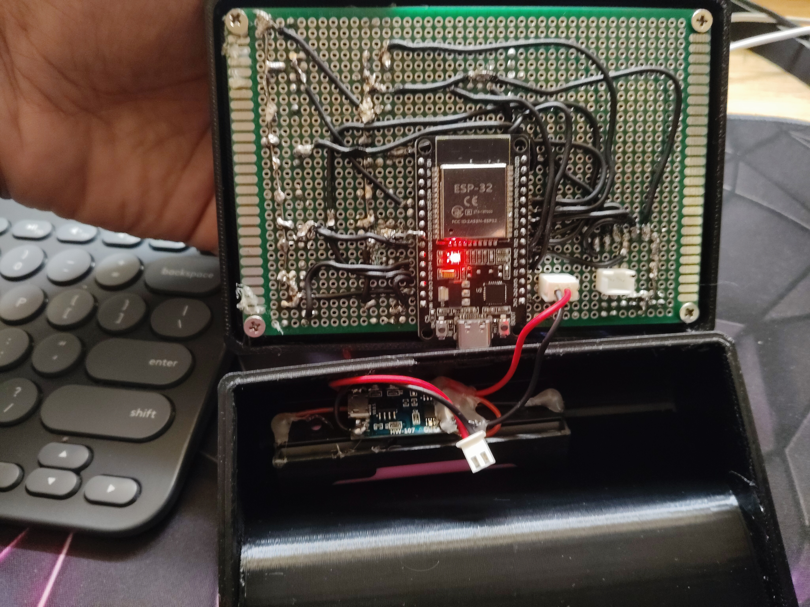
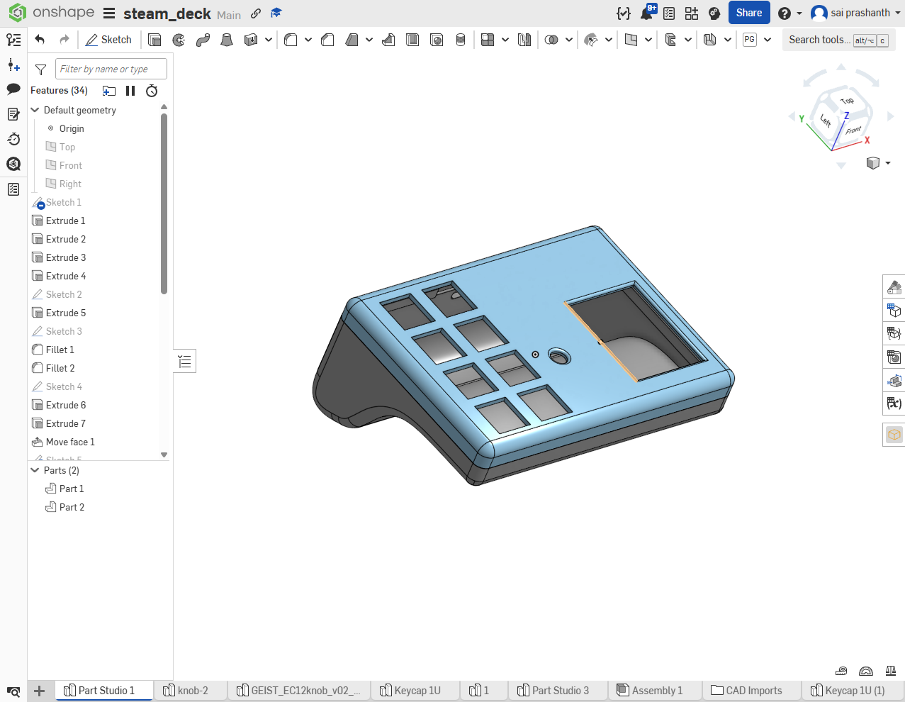
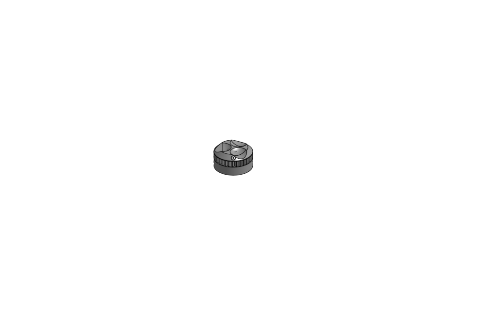

# ESP32 BLE MacroPad

> **v2 hardware + v3 firmware** — fully assembled, battery-powered, wireless BLE macro pad with 8 buttons, rotary encoder, 1.8" TFT display and a custom FDM enclosure.

[](https://creativecommons.org/licenses/by-nc/4.0/)

---

## 📸 Build Photos

| Assembled v2 | Internals |
|:---:|:---:|
|  |  |

| CAD — Body | CAD — Encoder Knob |
|:---:|:---:|
|  |  |

> Drop your photos into `images/` with those filenames and they'll appear here automatically.

---

## ✨ Features (v3 Firmware)

- **8-button layout** — 4×2 grid with custom FDM printed keycaps
- **8 presets** — OnShape · KiCad · Music · Gaming · LTspice · Custom ×3
- **BUILD MODE** — remap any button to any action live, no reflashing needed (hold encoder 1.5s)
- **60+ actions** — system shortcuts, media, edit, CAD, PCB, browser, gaming, LTspice
- **Rotary encoder** — 4 modes: VOL / SCROLL / ZOOM / ALT-TAB
- **1.8" ST7735 TFT** — double-buffered sprite UI, per-preset accent colours
- **BLE HID** — pairs as a standard Bluetooth keyboard, no dongle
- **Backlight PWM** — adjustable brightness via settings menu
- **Settings menu** — brightness, sleep timeout, encoder sensitivity (hold encoder 0.7s)
- **2600mAh Li-Po + RTOS light-sleep** — upwards of 3–4 months of typical desk use per charge
- **Fully wireless** — no USB required during use

---

## 🕹 Controls

| Action | What it does |
|---|---|
| Short press encoder | Lock / unlock mode |
| Hold encoder 0.7s | Open settings menu |
| Hold encoder 1.5s | Enter BUILD MODE |
| Turn encoder (unlocked) | Cycle encoder mode |
| Turn encoder (locked) | Control active mode (vol / scroll / zoom / alt-tab) |
| Press button (unlocked) | Switch to that preset |
| Press button (locked) | Fire assigned macro |

---

## 🎹 Default Presets

### OnShape (8 buttons)
| B1 | B2 | B3 | B4 |
|---|---|---|---|
| Fit | Front | Top | Right |
| **B5** | **B6** | **B7** | **B8** |
| Iso | Extrude | Sketch | Mate |

### KiCad (8 buttons)
| Route | ZFit | DRC | 3D View |
|---|---|---|---|
| Copper | Gerber | Ratsnest | Add Net |

### Music (6 buttons)
| Play/Pause | Next | Prev | Mute |
|---|---|---|---|
| Spotify | Min All | — | — |

### Gaming (8 buttons)
| PTT | Reload | Map | Scoreboard |
|---|---|---|---|
| Fullscreen | OBS Rec | OBS Stream | Discord |

### LTspice (8 buttons)
| Move | GND | VCC | Resistor |
|---|---|---|---|
| Capacitor | Add Component | Wire | Run Sim |

### Custom 1–3
Fully remappable via BUILD MODE.

---

## 🔌 Pin Reference

| Function | GPIO |
|---|---|
| Button 1–8 | 14, 13, 26, 25, 22, 21, 35, 19 |
| Encoder CLK | 2 |
| Encoder DT | 4 |
| Encoder SW | 15 |
| TFT CS | 5 |
| TFT DC | 17 |
| TFT RST | 16 |
| TFT Backlight (PWM) | 12 |

> All buttons are direct GPIO (INPUT_PULLUP, active LOW). No matrix scanning on this hardware revision — each button has its own pin.

---

## 📦 Dependencies (Arduino IDE)

Install via Library Manager or GitHub:

| Library | Author |
|---|---|
| [ESP32 BLE Keyboard](https://github.com/T-vK/ESP32-BLE-Keyboard) | T-vK |
| [TFT_eSPI](https://github.com/Bodmer/TFT_eSPI) | Bodmer |
| Arduino core for ESP32 | Espressif |

### TFT_eSPI `User_Setup.h`

```cpp
#define ST7735_DRIVER
#define TFT_CS   5
#define TFT_DC  17
#define TFT_RST 16
#define TFT_WIDTH  128
#define TFT_HEIGHT 160
```

---

## 🖨 CAD & Enclosure

- Modelled in **Onshape** — browser-based, free for public projects
- Printed in **PLA** on FDM printer — 0.2mm layer height, 3 walls, 20% gyroid infill
- Custom square keycaps — printed separately, press-fit over tact switches
- Skull encoder knob — press-fit on EC11 D-shaft
- Enclosure splits into top shell (buttons + display) and base (PCB + battery)

---

## 🔋 Power

| Component | Detail |
|---|---|
| Cell | 18650 Li-Ion, 2600mAh |
| Charger | TP4056 (HW-107) with protection |
| Estimated battery life | **3–4 months** typical desk use with RTOS light-sleep |
| Charging | Via USB-C on ESP32 dev board |

---

## 🗂 Repo Structure

```
ESP32-BLE-MacroPad/
├── firmware/
│   └── macropad_v3.ino       # v3 firmware — copy-paste ready
├── hardware/
│   └── pin_reference.md      # Full GPIO table
├── cad/
│   └── README.md             # Print settings, Onshape notes
├── images/                   # Build photos (add yours here)
└── README.md
```

---

## 🗺 Roadmap

- [x] v1 — 6-button prototype on perf board, basic firmware
- [x] v2 — 8-button build, FDM enclosure, battery, custom keycaps + skull knob
- [x] v3 firmware — 8 presets, BUILD MODE, 60+ actions, settings menu
- [ ] v3 hardware — custom KiCad PCB
- [ ] v3 CAD — tighter tolerances, snap-fit lid, proper standoffs
- [ ] v4 — investigate QMK / ZMK port

---

## 🪪 License

**CC BY-NC 4.0** — Free to use and modify for personal/non-commercial purposes only.
Commercial use is not permitted without explicit written permission from the author.

Full license: [creativecommons.org/licenses/by-nc/4.0](https://creativecommons.org/licenses/by-nc/4.0/)

---

## 🙌 Credits

Built by **Sai Prashanth**
CAD in Onshape · Firmware in Arduino C++ · Hand-wired on perf board

🔗 GitHub: [github.com/saiprashanth802/ESP32-BLE-Macropad](https://github.com/saiprashanth802/ESP32-BLE-Macropad)
