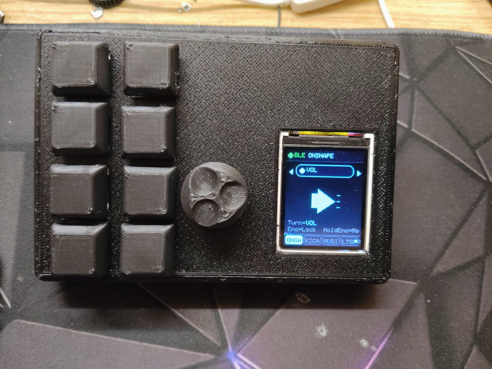
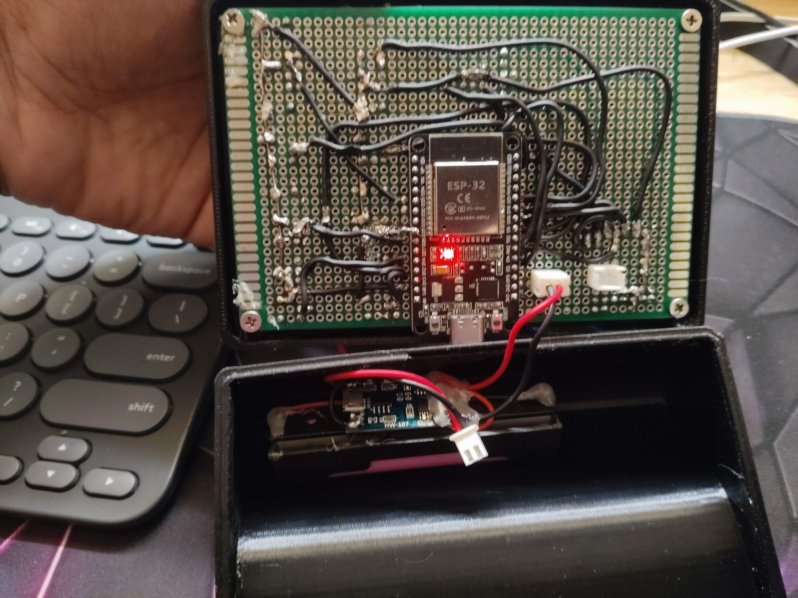
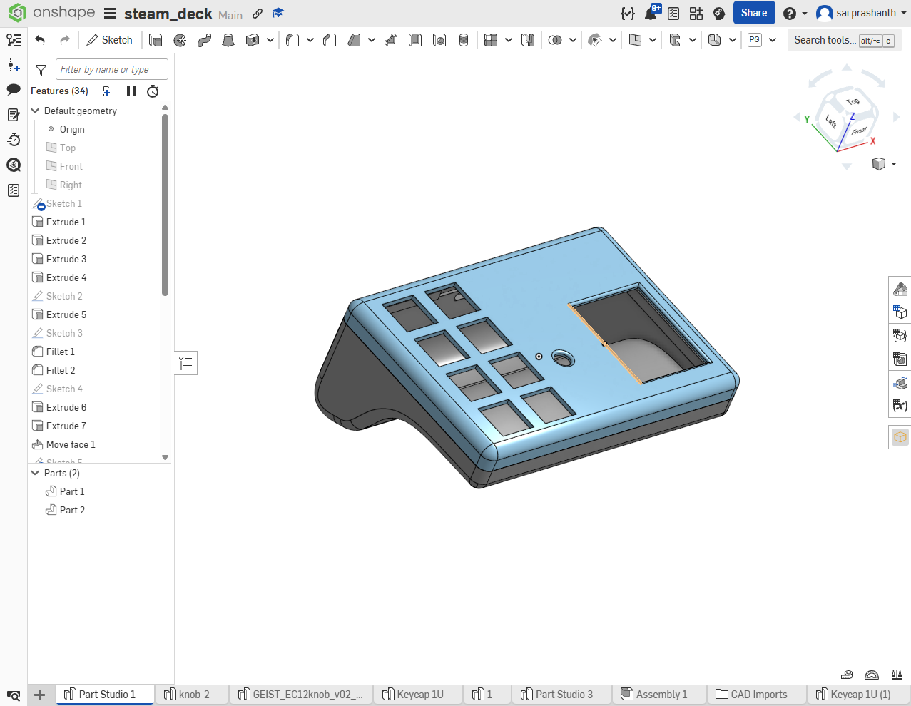
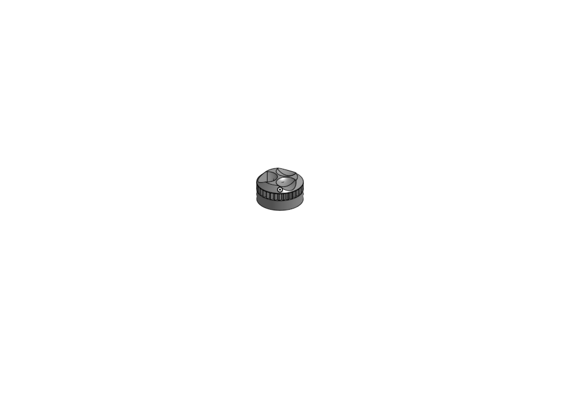
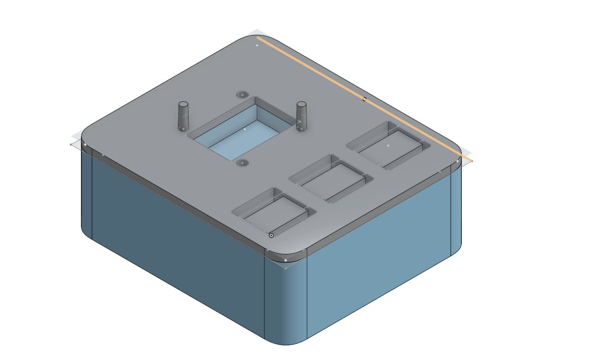
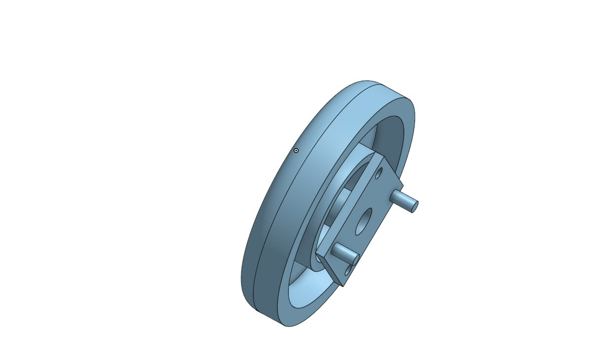
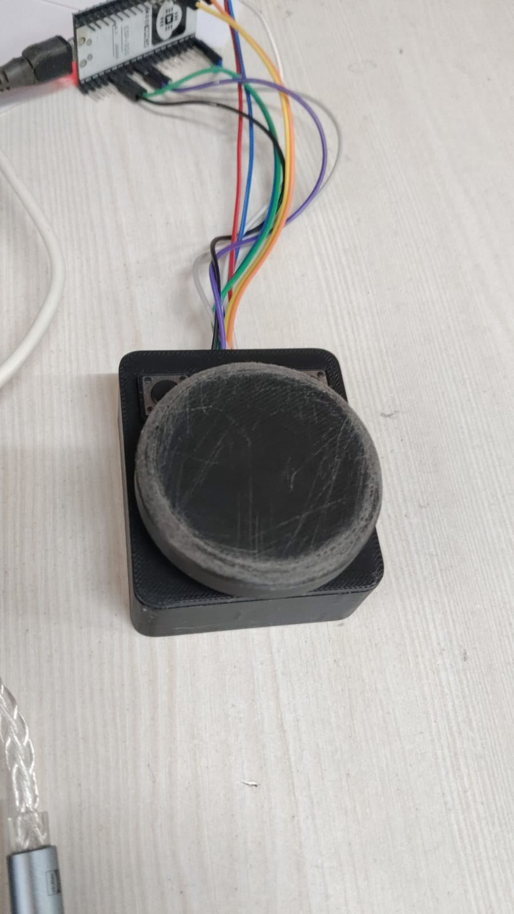
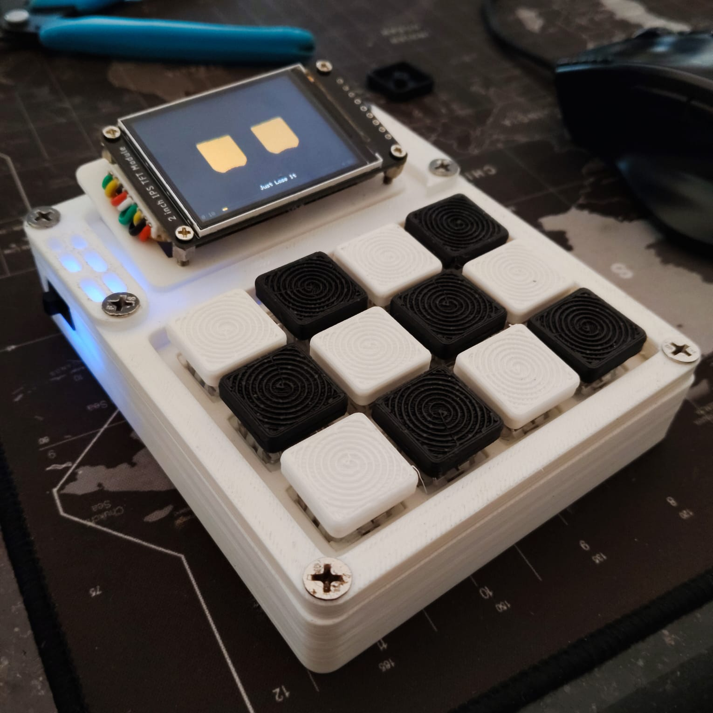
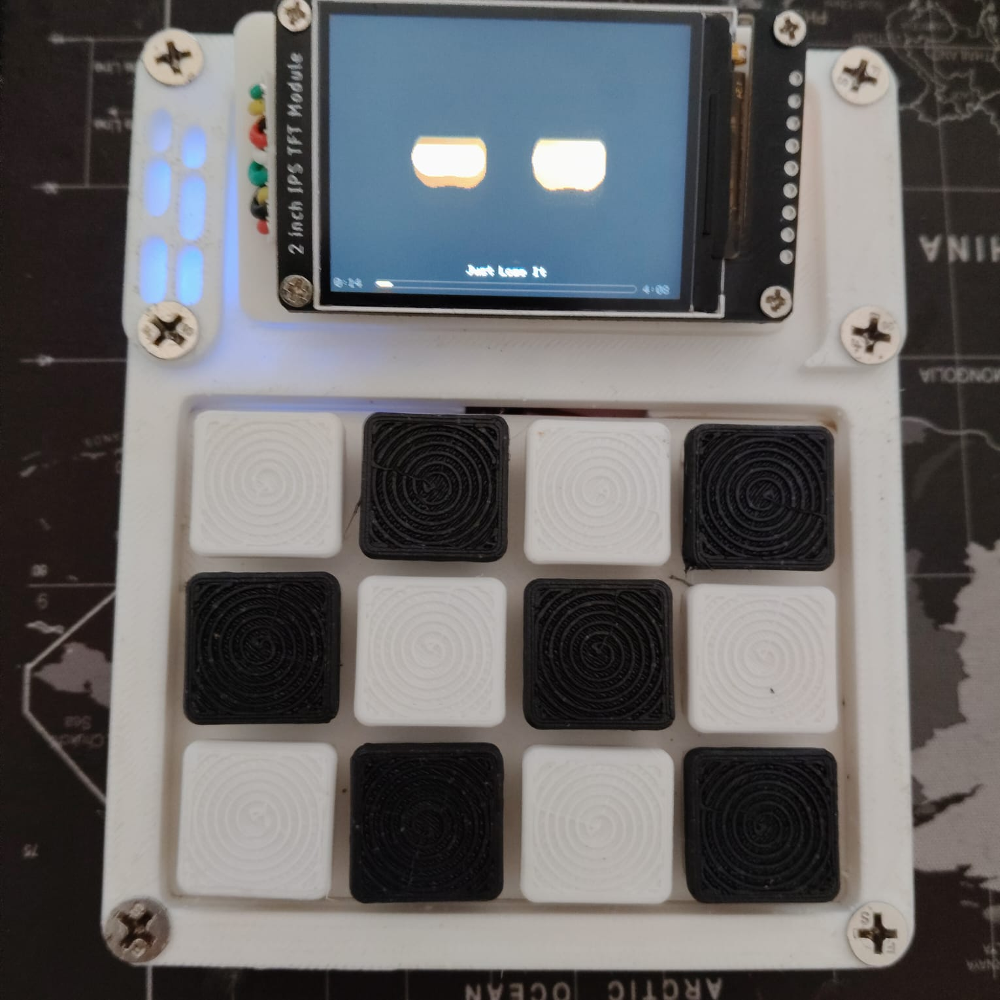
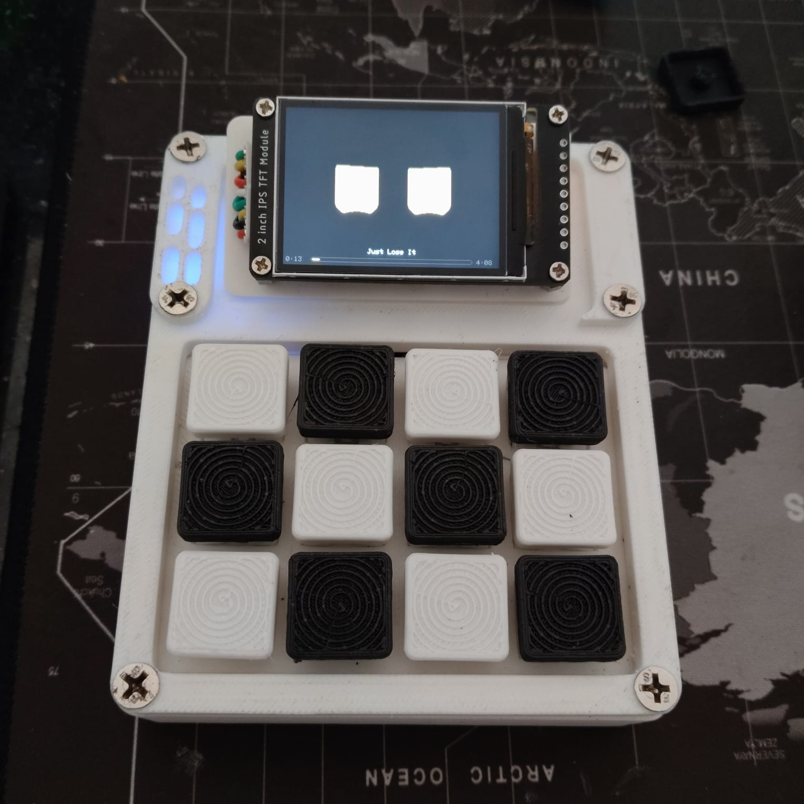

# ESP32 BLE HID MacroPad

> An open-source, battery-powered wireless BLE HID macro pad built on ESP32 with NimBLE stack. Hand-wired with a custom FDM-printed enclosure, fully self-contained shortcut controller with an on-device UI — no companion app required.

[](https://creativecommons.org/licenses/by-nc/4.0/)

---

## Versions

| Version | Status | Description |
|---------|--------|-------------|
| v3 | ✅ Complete | 8-button, ST7735 128×160, ESP32-BLE-Keyboard — flagship build |
| v4 | ✅ Stable | NimBLE stack, ghost connection fix, BUILD MODE |
| v4 + Media Remote | 🔬 Testing | Wireless AS5600 scroll wheel via ESP-NOW |
| v5 | ✅ Built & Running | 12-key MX matrix, ST7789 240×320, multi-host BLE, robot face, Windows companion app |

---

## v3 — Flagship Build

> Primary portfolio entry. 8-button macro pad with ST7735 display, NimBLE BLE HID, and on-device preset switching with BUILD MODE.

### Build Photos

| | |
|---|---|
|  |  |
| Assembled v3 | Internal wiring |

| | |
|---|---|
|  |  |
| Enclosure CAD | Encoder knob CAD |

### Hardware
- ESP32 WROOM-32
- ST7735 128×160 TN display
- 8× tactile switches in 4×2 layout
- EC11 rotary encoder + custom skull knob
- TP4056 + 18650 2600mAh battery
- M3 corner studs with heat-set inserts
- Hand-wired, FDM printed enclosure (PLA, 0.2mm, 20% gyroid)

### Features
- 8 presets: OnShape, KiCad, Music, Gaming, LTspice, SYS, DEV, EDIT
- BUILD MODE — remap any button live (hold encoder 1.5s)
- Encoder modes: VOL / SCROLL / ZOOM / ALT-TAB
- Settings menu: brightness, sleep timeout, sensitivity, OS layout
- OS Layout: Windows / Linux — remaps shortcuts live
- RTOS light-sleep with GPIO wakeup
- Wake-key buffer + reconnect HUD
- BLE bond clear (hold encoder 3s)
- Estimated battery life: 3–4 months typical desk use

### GPIO Allocation (v3/v4)

| GPIO | Function |
|------|----------|
| 14,13,26,25,22,21,35,19 | 8× buttons |
| 2, 4 | Encoder CLK, DT |
| 15 | Encoder SW |
| 5, 17, 16, 12 | TFT CS, DC, RST, BL |
| 23, 18 | SPI MOSI, SCLK |

---

## v4 — Current Stable

> Migrated to NimBLE-Arduino to fix persistent BLE ghost-connection bug on Windows sleep/wake cycles.

### Key Changes from v3
- NimBLE-Arduino replaces ESP32-BLE-Keyboard
- GAP-layer callbacks for reliable connect/disconnect tracking
- 1N5819 Schottky diode on VIN rail isolating charger from USB supply
- `esp_sleep_disable_wakeup_source()` before re-arming GPIO wakeup each cycle
- `ledcAttach()` called on every wake to restore PWM backlight
- Firmware: `macropad_v4_nimble_espnow.ino`

### TFT_eSPI User_Setup.h

```cpp
#define ST7735_DRIVER
#define TFT_CS   5
#define TFT_DC   17
#define TFT_RST  16
#define TFT_WIDTH  128
#define TFT_HEIGHT 160
#define TFT_MOSI 23
#define TFT_SCLK 18
```

---

## Media Remote — Test Phase

> Standalone wireless scroll wheel using AS5600 magnetic encoder. Connects to v4 macropad via ESP-NOW or directly to PC via BLE HID. Designed for high-resolution smooth scrolling with velocity-based acceleration.

### Hardware
- ESP32 NodeMCU dev board
- AS5600 magnetic rotary encoder (I2C, 12-bit resolution, 4096 steps/rev)
- Custom 3D printed enclosure with bearing-mounted 50mm scroll wheel
- Diametrically magnetized cylinder magnet on axle
- 3× tactile buttons — Play/Pause, Next, Prev

### Design & Prototype

| | |
|---|---|
|  |  |
| Enclosure CAD | Scroll wheel with bearing mount CAD |



*Prototype — printed enclosure with 50mm scroll wheel, AS5600 underneath, wired to NodeMCU ESP32S*

### Features
- Velocity-accelerated volume control — slow turn = fine steps, fast spin = large jumps
- Adjustable sensitivity 1–10, saved to NVS
- Hold Btn1 + turn wheel = adjust sensitivity live
- Hold Btn1 + Btn3 for 1.5s = toggle ESP-NOW ↔ BLE mode
- Mode and sensitivity persist across power cycles
- LED blink feedback: 1 blink = ESP-NOW, 3 blinks = BLE

### Modes

| Mode | Description |
|------|-------------|
| BLE HID | Connects directly to PC as "MediaRemote" |
| ESP-NOW | Sends to v4 macropad which relays via BLE to PC |

### Wiring

| Pin | GPIO | Function |
|-----|------|----------|
| AS5600 SDA | 21 | I2C data |
| AS5600 SCL | 22 | I2C clock |
| BTN1 Play/Pause | 27 | INPUT_PULLUP → GND |
| BTN2 Next | 26 | INPUT_PULLUP → GND |
| BTN3 Prev | 25 | INPUT_PULLUP → GND |
| LED | 2 | Onboard LED |

---

## v5 — Built & Running

> Full redesign, **assembled and working**. 12-key MX mechanical switch matrix (4×3 landscape), ST7789 240×320 IPS display, **multi-host BLE with 3 device slots (Logitech Easy-Switch style)**, a state-reactive robot face with personalities, and a Windows companion app that turns the pad into a Stream Deck.

### Build Photos

| | |
|---|---|
|  |  |
| Assembled v5 — printed case, spiral-top keycaps, blue accent lighting | Top-down: 4×3 MX grid and the 2" IPS display |



*The screen shows the pad's two live features at once: the procedural robot eyes in
their default robotic blue, and the now-playing strip — track title with a progress
bar and elapsed/total time, streamed from the host by the companion app.*

**Print files:** [`cad/stl/v5/`](cad/stl/v5) — three case parts plus the switch plate.

### Multi-Host BLE — use it like a Pebble Keys
- 3 host slots, each remembers one bonded device (NVS persisted across power cycles)
- Hold **FN (K9) 1s** → tap **K1/K2/K3** to jump between paired devices
- Hold the slot key 1.5s instead to (re-)pair that slot with a new device
- Switching re-advertises **accept-list filtered** to the slot's bonded host, so only the selected device reconnects; a wrong bonded host that connects anyway is rejected in software
- Status bar shows the three slots like Easy-Switch LEDs (green = connected, amber = waiting, magenta = pairing)
- Firmware: `firmware/v5/macropad_v5.ino` (NimBLE 2.x API, single file)

### Face — state-reactive robot eyes / GIF screensaver
- Procedural eyes that react to device state: blink when idle-connected, dart when disconnected, widen in pairing mode, glance toward the slot on Easy-Switch, droop before sleep
- **Expression packs**: every eye parameter (color, geometry, blink/glance timing) is JSON in the config API — the companion app can generate personalities without reflashing
- Or upload a looping **GIF** (≤ ~700 KB) through the web UI as an ambient screensaver
- Settings → FACE (OFF/IDLE/ALWAYS) and STYLE (EYES/GIF); first press always just wakes, never types
- Custom partition table: dual 1.5 MB OTA slots + 896 KB SPIFFS for animations

### Config Mode — wireless setup + OTA firmware update
- **Settings → CONFIG (WiFi/OTA)** suspends BLE and raises a WiFi hotspot (`MacroPad-Setup` / `macropad123`, `http://192.168.4.1`)
- Built-in web UI + JSON API to remap keys, edit presets, and change settings — no re-flash needed
- Every key can be a built-in action, an **arbitrary modifier+keycode chord**, a media code, a **type-a-string**, or a **multi-step macro** — the schema a companion app targets
- **OTA firmware update**: upload a new `.bin` from the browser; it flashes the inactive OTA partition and reboots (safe rollback if it fails)
- WiFi and BLE never run at once (WROOM-32 coexistence); entering/leaving Config Mode reboots cleanly
- Full contract: [`docs/CONFIG_API.md`](docs/CONFIG_API.md)

### Hardware Spec
- NodeMCU ESP32-S V1.1 (WROOM-32) dev board
- ST7789 240×320 IPS display, landscape mount, glass flush-mounted (30.6×40.8mm active area)
- 12× MX compatible mechanical switches, plate mount, 4×3 landscape matrix, 19.05mm pitch
- 12× 1N4148 diodes for n-key rollover (cathode → row line — see `hardware/pin_reference_v5.md`)
- Wireless encoder puck: AS5600 + 50mm bearing-mounted dial on ESP12-E, ESP-NOW (separate device, firmware TBD)
- CKCS charge+boost module + 18650 cell
- Custom copper-tape ridge substrate PCB

### Enclosure
- 115×95×30mm main body
- Encoder dial lobe: half-proud right edge, 50mm diameter, 25mm proud (XP-Pen style)
- Screen: 31.0×41.2mm flush glass window, 35.2×48.4mm module ledge 2.1mm deep
- Bottom cover: M3 screws into brass heat-set inserts, 4× corners

### PCB Technique — Copper Tape Ridge Substrate
3D printed plate with elevated ridges as trace isolation guides. A single copper sheet is laid over the entire surface — the ridges act as cutting guides. Scalpel-cut along ridge edges isolates traces. Looks like a real PCB, built from scratch.

### v5 GPIO Allocation

| GPIO | Board Label | Function | Notes |
|------|------------|----------|-------|
| 18 | P18 | TFT SCK | SPI clock |
| 23 | P23 | TFT MOSI | ST7789 SDA |
| 5  | P5  | TFT CS  | |
| 21 | P21 | TFT DC  | |
| 22 | P22 | TFT RST | |
| 19 | P19 | TFT BL  | PWM via LEDC |
| 25 | P25 | Matrix Row 1 | Driven LOW to scan |
| 26 | P26 | Matrix Row 2 | Driven LOW to scan |
| 27 | P27 | Matrix Row 3 | Driven LOW to scan |
| 32 | P32 | Matrix Row 4 | Driven LOW to scan |
| 33 | P33 | Matrix Col 1 | INPUT_PULLUP |
| 13 | P13 | Matrix Col 2 | INPUT_PULLUP |
| 14 | P14 | Matrix Col 3 | INPUT_PULLUP |

> Zero strapping pins used — clean boot every time, no pull resistors needed for boot. No I2C or encoder switch on the main board — the AS5600 puck is wireless. Full details + diode orientation: `hardware/pin_reference_v5.md`.

---

## Repository Structure

```
ESP32-BLE-MacroPad/
├── firmware/
│   ├── v4/
│   │   └── macropad_v4_nimble_espnow.ino  — v4 + optional ESP-NOW
│   ├── v5/
│   │   └── macropad_v5.ino                — v5 in development
│   ├── media_remote/
│   │   ├── media_remote.ino               — BLE + ESP-NOW dual mode
│   │   └── media_remote_dual_mode.ino     — switchable mode version
│   └── tests/
│       ├── AS5600_test.ino                — encoder verification
│       ├── ST7789_UI_test.ino             — display UI test
│       ├── button_test.ino                — button GPIO test
│       └── display_test_minimal.ino       — minimal display check
├── hardware/
│   ├── pin_reference_v5.md               — complete v5 GPIO table
│   └── ESP32_DevKitC_v4.kicad_mod        — custom KiCad footprint
├── images/
│   ├── assembled.jpg                      — v3 assembled
│   ├── internals.jpg                      — v3 internals
│   ├── cad_body.png                       — v3 enclosure CAD
│   ├── cad_knob.png                       — v3 encoder knob CAD
│   └── media_remote/
│       ├── enclosure_cad.png              — media remote enclosure CAD
│       ├── scroll_wheel_cad.png           — scroll wheel CAD
│       └── prototype_assembled.jpeg       — built prototype
└── README.md
```

---

## Dependencies

| Library | Purpose |
|---------|---------|
| NimBLE-Arduino | BLE HID stack |
| TFT_eSPI | Display driver |
| Preferences | NVS persistent storage |
| Wire | I2C for AS5600 |
| esp_now | ESP-NOW for media remote |

---

## Key Learnings

- **NimBLE vs ESP32-BLE-Keyboard** — NimBLE with GAP callbacks is required for reliable connect/disconnect tracking. The Arduino BLE stack returns false positives after Windows sleep/wake.
- **GPIO 12 strapping pin** — Must read LOW at boot. Avoided entirely in v5 by moving TFT backlight to GPIO 19.
- **LEDC + BLE init order** — BLE radio init resets the LEDC peripheral. Always call `ledcAttach()` after `NimBLEDevice::init()`.
- **WiFi + BLE coexistence** — ESP-NOW and NimBLE share the antenna. Made optional in v4 (toggle in settings) to avoid connection instability.
- **ST7789 RAM constraint** — Full 240×320 16-bit sprite = 153KB, too large for WROOM-32 with BLE active. Solution: direct TFT drawing with small reusable sprites.
- **Input-only GPIOs** — GPIO 34, 35, 36, 39 have no internal pullups. Always use external 10kΩ resistors.

---

## License

**CC BY-NC 4.0** — Free to use and modify for personal and non-commercial purposes only. Commercial use requires explicit written permission from the author.
